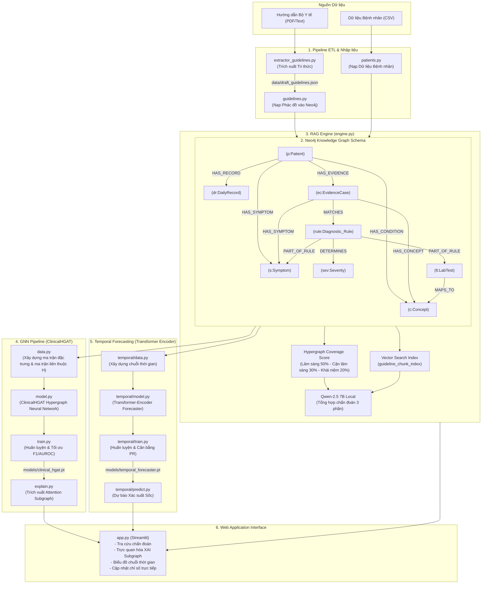

# KIẾN TRÚC VÀ PIPELINE HỆ THỐNG CLINICAL CDSS (DENGUE)

Tài liệu này giải thích chi tiết toàn bộ kiến trúc, luồng xử lý dữ liệu (pipeline), sơ đồ kết nối cơ sở dữ liệu đồ thị, và chức năng của từng file mã nguồn trong hệ thống Hỗ trợ Quyết định Lâm sàng (CDSS) cho bệnh Sốt xuất huyết Dengue.

---

## 1. Sơ đồ Kiến trúc Tổng thể (Architecture Overview)

Hệ thống CDSS được thiết kế dưới dạng một nền tảng **Hybrid AI** (Neuro-Symbolic), kết hợp giữa:
1. **Đồ thị tri thức (Knowledge Graph - Neo4j):** Lưu trữ hướng dẫn điều trị của Bộ Y tế và hồ sơ bệnh nhân dưới dạng mạng thực thể y khoa phức tạp.
2. **Suy diễn mờ/Luật phủ đồ thị (RAG Coverage Engine):** Tính toán phác đồ tham chiếu tối ưu theo phương pháp phủ đa chiều (Hypergraph Coverage) trên 3 chiều: Triệu chứng, Cận lâm sàng, và Khái niệm y khoa rủi ro.
3. **Mạng học sâu Siêu đồ thị dị thể (ClinicalHGAT):** Dự đoán mức độ nghiêm trọng và phân tích độ đóng góp của từng triệu chứng thông qua cơ chế Attention siêu đồ thị dị hợp (chạy trực tiếp trên ma trận đặc trưng nút và ma trận liên thuộc siêu đồ thị $H$).
4. **Dự báo chuỗi thời gian (Temporal Progression Predictor):** Dự đoán rủi ro sốc dựa trên diễn tiến xét nghiệm hàng ngày bằng mạng nơ-ron Transformer-Encoder kết hợp cơ chế Cross-Attention định hướng bởi đặc trưng tĩnh.



---

## 2. Chi tiết các Phân hệ trong Pipeline (Pipeline Subsystems)

### A. Phân hệ Nhập liệu & Xây dựng Đồ thị Tri thức (ETL & KG Construction)
1. **Trích xuất tài liệu (Guidelines Extraction):**
   * Tập tin `extractor_guidelines.py` thực hiện phân tách tài liệu PDF chuẩn của Bộ Y tế về Sốt xuất huyết. Nó phân tích cấu trúc văn bản và tách thành các khối luật chẩn đoán, lưu nháp vào `data/draft_guidelines.json` để chuyên gia y tế rà soát.
2. **Nạp luật vào Graph (Guidelines Loading):**
   * Tập tin `guidelines.py` đọc cấu trúc JSON và tạo các thực thể trên Neo4j. Đồng thời, nó tạo chỉ mục tìm kiếm vector (vector index) để hỗ trợ tìm kiếm ngữ nghĩa sâu.
3. **Nạp dữ liệu bệnh nhân (Patients Loading):**
   * Tập tin `patients.py` nạp hồ sơ bệnh án từ CSV nghiên cứu. Đối với mỗi bệnh nhân, script tự động:
     * Tính toán các chỉ số Nadir (mức tiểu cầu thấp nhất), Peak (mức cô đặc máu cao nhất), đỉnh HFLC.
     * Suy diễn các khái niệm lâm sàng như: *Giảm tiểu cầu rất nặng* (PLT < 20 G/L hoặc PLT < 50 G/L kèm tốc độ giảm nhanh), *Cô đặc máu* (HCT tăng > 20% so với nền), *Biến chứng gan thận*.
     * Kết nối bệnh nhân với các triệu chứng lâm sàng và các khái niệm y khoa tương ứng.

### B. Bộ máy Tìm kiếm & Lập luận Lai (RAG Hybrid Reasoning Engine)
* Nằm tại `clinical_cdss/rag/engine.py`. Khi bác sĩ tra cứu một bệnh nhân, bộ máy thực hiện:
  1. **Tính điểm Coverage đa chiều (3-Dimension Hypergraph Coverage):**
     * **Chiều Lâm sàng (Symptom - Trọng số 50%):** So khớp trực tiếp triệu chứng của bệnh nhân với triệu chứng yêu cầu của phác đồ.
     * **Chiều Cận lâm sàng (LabTest - Trọng số 30%):** So khớp thông qua cầu nối ngữ nghĩa (Semantic Bridge). Ví dụ: bệnh nhân có chỉ số `PLT=15 G/L` $\rightarrow$ map sang khái niệm `Giảm tiểu cầu nặng` $\rightarrow$ so khớp với yêu cầu cận lâm sàng trong phác đồ.
     * **Chiều Khái niệm Y khoa (Concept - Trọng số 20%):** So khớp các biến chứng suy diễn trực tiếp như suy gan, suy thận, sốc.
  2. **Logic Sắp xếp Ưu tiên Lâm sàng (Tie-breaker logic):**
     * Trong trường hợp nhiều phác đồ có độ phủ tương đương, hệ thống áp dụng bộ lọc ưu tiên theo độ nguy hiểm lâm sàng:
       $$\text{Sốc nặng/Thất bại dịch truyền} > \text{Sốc Dengue} > \text{Có dấu hiệu cảnh báo} > \text{Sốt xuất huyết thông thường} > \text{Chưa phân loại}$$
  3. **Tích hợp RAG với mô hình ngôn ngữ lớn (LLM):**
     * Hệ thống tìm kiếm tài liệu gốc (chunks) trong vector index dựa trên các khái niệm khớp của bệnh nhân.
     * Gửi ngữ cảnh (dữ liệu bệnh nhân + tài liệu BYT gốc) đến LLM Qwen-2.5 7B để tổng hợp thành báo cáo chuyên môn có cấu trúc 3 phần bằng tiếng Việt học thuật, tuyệt đối không tự ý kê đơn thuốc.

### C. Phân hệ Mạng nơ-ron Siêu đồ thị Dị thể (Heterogeneous Hypergraph GNN Pipeline)
* Nằm trong thư mục `clinical_cdss/gnn/`.
  1. **Xây dựng siêu đồ thị dị thể (`data.py`):**
     * Định nghĩa các kiểu nút y khoa dị hợp: `Patient`, `EvidenceCase` (ca bệnh án), `Symptom`, `Concept`, `Diagnostic_Rule`.
     * Xuất dữ liệu từ Neo4j thành ma trận đặc trưng nút của từng loại và **Ma trận liên thuộc Siêu đồ thị H** ($H \in \{0, 1\}^{|\mathcal{V}| \times |\mathcal{E}_H|}$).
  2. **Mô hình ClinicalHGAT (`model.py`):**
     * Sử dụng mạng Attention siêu đồ thị dị hợp (Heterogeneous Hypergraph Attention Network).
     * **Hypergraph Attention:** Lan truyền thông tin qua 2 chiều. *Node-to-Edge Attention* ($\alpha$) tính toán trọng số quyết định của từng nút thành phần (triệu chứng, chỉ số) trong siêu cạnh. *Edge-to-Node Attention* ($\beta$) xác định mức độ tác động của ngữ cảnh siêu cạnh lên từng nút.
  3. **Giải thích mô hình (`explain.py` & `predict.py`):**
     * Trích xuất đồ thị con (subgraph) chứa các nút triệu chứng và khái niệm có trọng số attention cao nhất để hiển thị trực quan cho bác sĩ, giúp giải thích đường đi lập luận của mạng học sâu.

### D. Phân hệ Dự báo Tiến triển Lâm sàng (Temporal Progression Pipeline)
* Nằm trong thư mục `clinical_cdss/temporal/`.
  * Khác với GNN tập trung vào phân loại mức độ nặng hồi cứu (overall stay), phân hệ này tập trung vào chuỗi thời gian xét nghiệm hàng ngày (`DailyRecord`).
  * Sử dụng mạng **Transformer Encoder** kết hợp cơ chế **Cross-Attention** định hướng bởi các đặc trưng tĩnh (demographics, triệu chứng nền) để xử lý dữ liệu chuỗi thời gian biến thiên (tiểu cầu giảm dần, hematocrit tăng vọt).
  * Đầu ra cung cấp:
    1. Xác suất xảy ra biến chứng sốc (`shock_probability`) trong vòng 24 đến 48 giờ tới.
    2. Chỉ số rủi ro tiến triển tổng thể (`forecast_risk`).
    3. Trọng số Attention theo ngày (ngày bệnh nào trong quá khứ có biến động chỉ số ảnh hưởng nhiều nhất đến dự báo hiện tại).

---

## 3. Danh mục & Vai trò của Từng File Code (File Catalog)

| Đường dẫn tập tin | Vai trò / Chức năng chính |
| :--- | :--- |
| `app.py` | Giao diện chính Streamlit, tích hợp toàn bộ luồng RAG, biểu đồ temporal và trực quan hóa XAI. |
| `main.py` | Script khởi chạy hệ thống ở chế độ dòng lệnh (CLI). Chứa hàm initialize_system() để thiết lập database ban đầu. |
| `requirements.txt` | Danh sách thư viện Python cần thiết (Pytorch, PyG, Streamlit, Neo4j, v.v.). |
| **`clinical_cdss/core/`** | |
| `├─ database.py` | Lớp quản lý kết nối Neo4j, khởi tạo Schema, Vector Index và thực thi Cypher. |
| `├─ config.py` | Cấu hình tham số kết nối Neo4j và địa chỉ gọi LLM Local. |
| **`clinical_cdss/etl/`** | |
| `├─ extractor_guidelines.py` | Parsing hướng dẫn y khoa PDF/Text thành file JSON bán cấu trúc. |
| `├─ guidelines.py` | Định nghĩa schema đồ thị y khoa và nạp luật điều trị vào Neo4j. |
| `├─ patients.py` | Nạp dữ liệu bệnh nhân từ CSV, thực hiện các suy luận logic lâm sàng để tạo Concept. |
| **`clinical_cdss/clinical/`** | |
| `├─ daily_update.py` | Hàm cập nhật chỉ số xét nghiệm hàng ngày, tự động tính toán lại Concept y khoa cho bệnh nhân. |
| **`clinical_cdss/rag/`** | |
| `├─ engine.py` | Thuật toán Hypergraph Coverage 3 chiều, lọc phác đồ ưu tiên, truy vấn Vector và sinh báo cáo y khoa. |
| **`clinical_cdss/gnn/`** | |
| `├─ data.py` | Xuất dữ liệu từ Neo4j sang các ma trận đặc trưng nút và ma trận liên thuộc siêu đồ thị H. |
| `├─ model.py` | Định nghĩa kiến trúc mạng nơ-ron siêu đồ thị ClinicalHGAT (Attention hai chặng Node-to-Edge và Edge-to-Node). |
| `├─ train.py` | Huấn luyện mô hình phân loại GNN bằng Weighted Cross-Entropy Loss, lưu trọng số mô hình tốt nhất. |
| `├─ predict.py` | Thực thi dự đoán GNN, tích hợp bộ định tuyến an toàn và giải thích đồ thị con. |
| `├─ explain.py` | Trích xuất các thực thể và trọng số attention hỗ trợ giải thích chẩn đoán. |
| **`clinical_cdss/temporal/`** | |
| `├─ data.py` | Chuẩn bị chuỗi dữ liệu đầu vào (WBC, PLT, HCT, HFLC) từ các DailyRecord kế tiếp. |
| `├─ model.py` | Định nghĩa kiến trúc mạng nơ-ron Transformer Encoder với Static-guided Cross-Attention. |
| `├─ train.py` | Huấn luyện mô hình dự báo diễn tiến nguy cơ sốc (look-ahead 24-48h). |
| `├─ predict.py` | Thực hiện dự báo rủi ro tiến triển sốc của bệnh nhân theo thời gian thực. |
| **`scripts/`** | |
| `├─ download_embedding_model.py` | Tự động tải mô hình Sentence-Transformers về máy để chạy local offline. |
| `├─ check_*.py / fix_*.py` | Các script kiểm tra tính đúng đắn dữ liệu, sửa lỗi định dạng ký tự lạ (PUA) trong phác đồ. |

---

## 4. Cơ chế hoạt động của Luồng Chẩn đoán (Diagnostic Flow)

Khi bác sĩ nhập tên/ID bệnh nhân (ví dụ: `nguyenductuyen`):

```
[Bác sĩ tra cứu Patient ID]
      │
      ▼
[Bước 1: Khởi chạy mô hình GNN (ClinicalCDSS.diagnose)]
      │
      ├─► GNN khả dụng & độ tin cậy >= 75%?
      │     ├─► CÓ: Kiểm tra kích hoạt dấu hiệu nặng lâm sàng thực tế (T_severe)?
      │     │     ├─► CÓ & GNN dự đoán nhẹ/cảnh báo (< 2): Ép buộc chuyển sang chế độ dự phòng (Fallback).
      │     │     └─► KHÔNG: Lấy kết quả GNN. Trích xuất Subgraph chứa Top-Attention Nodes.
      │     │
      │     └─► KHÔNG: Chuyển sang chế độ dự phòng (RAG Coverage Score Fallback).
      │
      ▼
[Bước 2: Tìm kiếm ngữ cảnh phác đồ y tế (MedicalGraphRAG)]
      │
      ├─► Tính điểm phủ đa chiều (Symptom, LabTest, Concept).
      ├─► Sắp xếp phác đồ theo độ nghiêm trọng lâm sàng (Tie-breaker logic).
      └─► Vector search tìm tài liệu gốc từ Bộ Y tế (GuidelineChunk).
      │
      ▼
[Bước 3: Gọi LLM sinh báo cáo y khoa (rag.generate_response)]
      │
      └─► LLM tổng hợp Context thành báo cáo 3 phần (Lâm sàng, Giai đoạn, Giải thích đồ thị) kèm trích dẫn số trang.
      │
      ▼
[Bước 4: Chạy dự báo chuỗi thời gian (TemporalDiseaseForecaster)]
      │
      └─► Tính toán xác suất sốc (24-48h) và vẽ biểu đồ diễn tiến chỉ số máu qua các ngày bệnh.
```

Hệ thống hoạt động khép kín, tối ưu hóa tính minh bạch y khoa thông qua Explainability (XAI) và đảm bảo an toàn tối đa cho bệnh nhân nhờ bộ định tuyến định hướng an toàn lâm sàng (Safety Gated Router).
